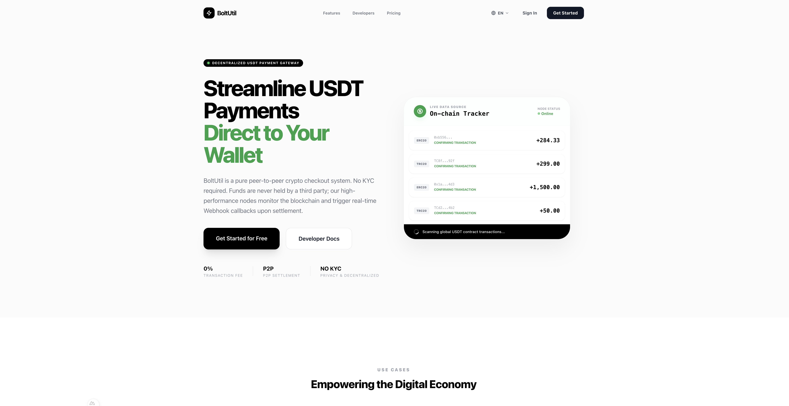
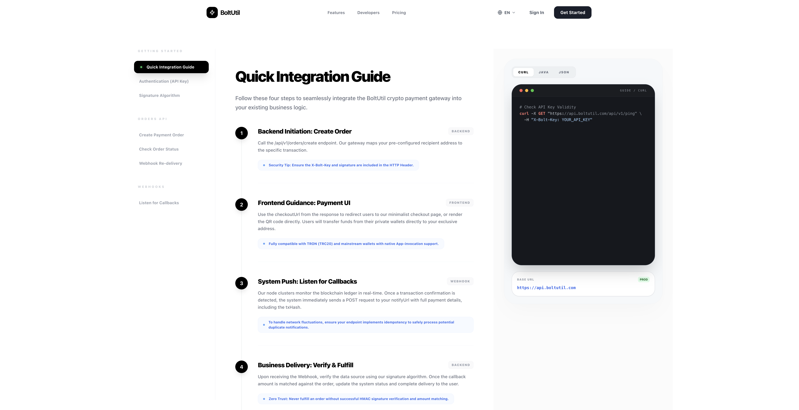
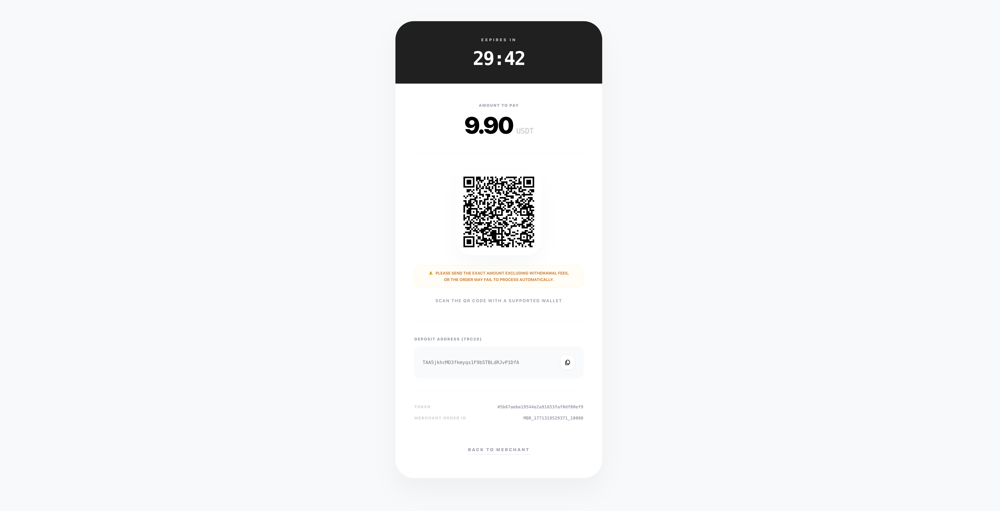
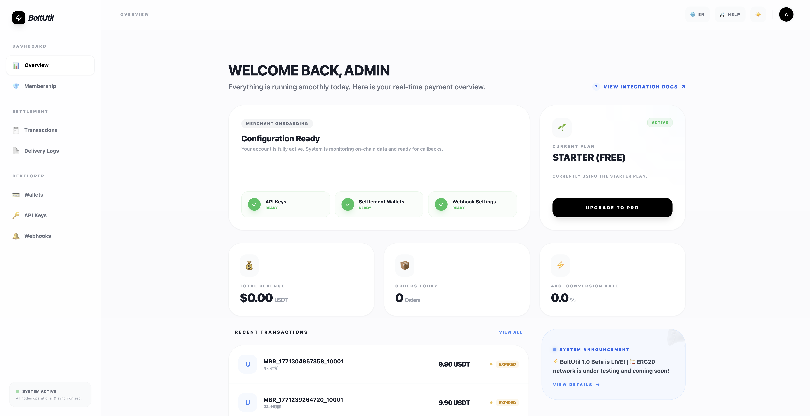

  
  <h1>BoltUtil Protocol</h1>
  
<b>面向开发者的企业级非托管 USDT 支付基础设施</b>

  
<i>The Enterprise-Grade Non-Custodial USDT Payment Infrastructure</i>

  

    <a href="#-简体中文">简体中文</a> | 
    <a href="#-english">English</a> | 
    <a href="#-español">Español</a> | 
    <a href="#-français">Français</a> | 
    <a href="#-português">Português</a> | 
    <a href="#-türkçe">Türkçe</a> | 
    <a href="#-tiếng-việt">Tiếng Việt</a> | 
    <a href="#-pусский">Русский</a> | 
    <a href="#-بالعربية">العربية</a> | 
    <a href="#-हिन्दी">हिन्दी</a> | 
    <a href="#-日本語">日本語</a> | 
    <a href="#-한국어">한국어</a>
  

  
  
  

---

## 🚀 核心搜索索引 (Quick Index)
`USDT 支付网关`, `USDT-TRC20 接口`, `USDT-ERC20 自动回调`, `USDT-BEP20 监控`, `免签支付系统`, `Crypto Payment Gateway`, `Non-custodial USDT API`, `Blockchain Webhook`.

---

## 🇨🇳 简体中文

### 📖 项目介绍
BoltUtil 是一套专为高并发业务设计的**非托管（Non-custodial）**支付监听协议。它消除了传统支付中介的资产性风险，资金通过区块链 P2P 协议**直达您的私有钱包**。系统内置响应式**生产级收银台**，开发者仅需通过 API 即可实现全球范围内的 USDT 结算自动化。

### 🛠️ 技术架构
* **全精度协议解析**：自研节点集群实时监控 **TRC20/ERC20** 与 **BEP20** 网络，原生支持多级精度无损对齐，确保每一笔微小转账都能精准触发逻辑。
* **工业级安全回调**：Webhook 采用标准 **HMAC-SHA256** 签名算法，结合 ASCII 字典序编码与 `API_SECRET` 加密，保障通知不被伪造。
* **开发者友好型集成**：提供详尽的 API 文档与多语言 SDK 示例，支持一键生成支付链接，大幅缩短上线周期。

### 🔒 安全机制
* **分布式共识校验**：基于多独立节点状态同步，有效规避链上双花攻击与回滚风险。
* **幂等性保障**：利用唯一链上 Hash (`trade_no`) 锁定订单状态，确保业务逻辑的一致性。

🔗 **[进入官网](https://boltutil.com)** | **[开发文档](https://boltutil.com/developer-docs)**

---

## 🇺🇸 English

### 📖 Project Introduction
BoltUtil is a **non-custodial** payment monitoring protocol designed for high-concurrency environments. By bypassing traditional intermediaries, funds flow P2P **directly to your private wallet**. It features a **production-ready responsive checkout**, enabling seamless USDT settlement via a unified API.

### 🛠️ Technical Architecture
* **Full-Precision Protocol Analysis**: Real-time monitoring of **TRC20/ERC20** and **BEP20** networks with native support for multi-decimal lossless alignment.
* **Enterprise-Grade Webhooks**: Notifications secured via **HMAC-SHA256** signatures, utilizing ASCII dictionary sorting and `API_SECRET` encryption.
* **Developer-Centric**: Comprehensive documentation and multi-language SDKs to minimize integration overhead.

### 🔒 Security Features
* **Distributed Consensus**: Multi-node state synchronization to defend against double-spending and chain rollbacks.
* **Idempotent Logic**: Every notification is tied to a unique on-chain Hash (`trade_no`) to ensure data integrity.

🔗 **[Official Website](https://boltutil.com)** | **[Developer Docs](https://boltutil.com/developer-docs)**

---

## 🇪🇸 Español
**Infraestructura de pago USDT no custodiada.** Compatible con **TRC20, ERC20 y BEP20**.
* **Liquidación Directa**: Los fondos llegan directamente a su billetera privada sin intermediarios.
* **Seguridad HMAC**: Webhooks protegidos con firmas **HMAC-SHA256**.
* **Checkout Listo para Usar**: Implemente una pasarela de pago profesional con un solo enlace API.

🔗 **[Sitio Web](https://boltutil.com)** | **[Documentación](https://boltutil.com/developer-docs)**

---

## 🇫🇷 Français
**Passerelle de paiement USDT non-custodial.** Support natif **TRC20, ERC20 et BEP20**.
* **Flux P2P**: Les fonds sont transférés directement vers votre portefeuille sécurisé.
* **Architecture Robuste**: Monitoring en temps réel avec validation multi-nœuds.
* **Intégration Rapide**: Checkout prêt à l'emploi et Webhooks sécurisés par **HMAC-SHA256**.

🔗 **[Site Officiel](https://boltutil.com)** | **[Documentation](https://boltutil.com/developer-docs)**

---

## 🇧🇷 Português
**Infraestrutura de pagamento USDT não-custodial.** Suporte **TRC20, ERC20 e BEP20**.
* **Liquidação Direta**: Os fundos fluem P2P para sua carteira privada.
* **Webhook Seguro**: Assinaturas **HMAC-SHA256** para garantir a integridade dos dados.
* **Checkout Integrado**: Página de pagamento responsiva pronta para produção.

🔗 **[Site Oficial](https://boltutil.com)** | **[Documentação](https://boltutil.com/developer-docs)**

---

## 🇹🇷 Türkçe
**Gözetimsiz (Non-custodial) USDT ödeme altyapısı.** **TRC20, ERC20 ve BEP20** desteği.
* **Doğrudan Cüzdana**: Fonlar doğrudan sizin özel cüzdanınıza aktarılır.
* **HMAC Güvenliği**: **HMAC-SHA256** imzalı güvenli Webhook bildirimleri.
* **Hazır Checkout**: Frontend geliştirme gerektirmeyen profesyonel ödeme sayfası.

🔗 **[Web Sitesi](https://boltutil.com)** | **[Dökümantasyon](https://boltutil.com/developer-docs)**

---

## 🇻🇳 Tiếng Việt
**Cổng thanh toán USDT phi lưu ký.** Hỗ trợ **TRC20, ERC20 và BEP20**.
* **Thanh toán P2P**: Tiền chuyển thẳng vào ví của bạn, không qua trung gian.
* **Chữ ký HMAC**: Bảo mật Webhook với thuật toán **HMAC-SHA256**.
* **Checkout có sẵn**: Trang thanh toán chuyên nghiệp chỉ với một liên kết API.

🔗 **[Trang chủ](https://boltutil.com)** | **[Tài liệu](https://boltutil.com/developer-docs)**

---

## 🇷🇺 Русский
**Некастодиальный платежный шлюз USDT.** Поддержка **TRC20, ERC20 и BEP20**.
* **Прямые расчеты**: Средства поступают напрямую на ваш кошелек.
* **HMAC-подпись**: Безопасные Webhook-уведомления с шифрованием **HMAC-SHA256**.
* **Готовый чекаут**: Профессиональная платежная страница без лишнего кода.

🔗 **[Сайт](https://boltutil.com)** | **[Документация](https://boltutil.com/developer-docs)**

---

## 🇸🇦 العربية
**بوابة دفع USDT غير احتجازية.** تدعم **TRC20 و ERC20 و BEP20**.
* **تسوية مباشرة**: تتدفق الأموال إلى محفظتك الخاصة مباشرة.
* **توقيع HMAC**: إشعارات Webhook آمنة باستخدام **HMAC-SHA256**.
* **صفحة دفع جاهزة**: واجهة دفع احترافية جاهزة للاستخدام الفوري.

🔗 **[الموقع الرسمي](https://boltutil.com)** | **[التوثيق](https://boltutil.com/developer-docs)**

---

## 🇮🇳 हिन्दी
**नॉन-कस्टोडियल USDT पेमेंट गेटवे।** **TRC20, ERC20 और BEP20** समर्थित।
* **सीधा सेटलमेंट**: फंड सीधे आपके वॉलेट में पहुंचता है।
* **HMAC सुरक्षा**: **HMAC-SHA256** के साथ सुरक्षित Webhook सूचनाएं।
* **रेडी चेकआउट**: बिना किसी कोडिंग के पेशेवर पेमेंट पेज।

🔗 **[वेबसाइट](https://boltutil.com)** | **[दस्तावेज़](https://boltutil.com/developer-docs)**

---

## 🇯🇵 日本語
**非管財型（ノンカストディアル）USDT決済ゲートウェイ。** **TRC20, ERC20, BEP20** 対応。
* **ダイレクト決済**: 資金はP2Pで直接ウォレットへ届きます。
* **HMACセキュリティ**: **HMAC-SHA256** 署名付きのセキュアなWebhook通知。
* **即時導入可能**: Frontend開発不要のチェックアウトページを完備。

🔗 **[公式サイト](https://boltutil.com)** | **[開発ドキュメント](https://boltutil.com/developer-docs)**

---

## 🇰🇷 한국어
**비수탁형(Non-custodial) USDT 결제 인프라.** **TRC20, ERC20, BEP20** 지원.
* **P2P 정산**: 자산은 귀하의 개인 지갑으로 직접 입금됩니다.
* **HMAC 보안**: **HMAC-SHA256** 알고리즘 기반의 안전한 Webhook 알림.
* **체크아웃 내장**: 프론트엔드 개발 없이 즉시 사용 가능한 결제 페이지 제공.

🔗 **[공식 웹사이트](https://boltutil.com)** | **[문서 페이지](https://boltutil.com/developer-docs)**

---

## 🖼️ 预览 (Preview)

<table>
  <tr>
    <td align="center"><b>官网主页 (Home)</b></td>
    <td align="center"><b>开发文档 (Docs)</b></td>
  </tr>
  <tr>
    <td></td>
    <td></td>
  </tr>
  <tr>
    <td align="center"><b>收银台 (Checkout)</b></td>
    <td align="center"><b>控制台 (Dashboard)</b></td>
  </tr>
  <tr>
    <td></td>
    <td></td>
  </tr>
</table>

---
© 2026 BoltUtil Protocol. Built by Developers, for Developers.
