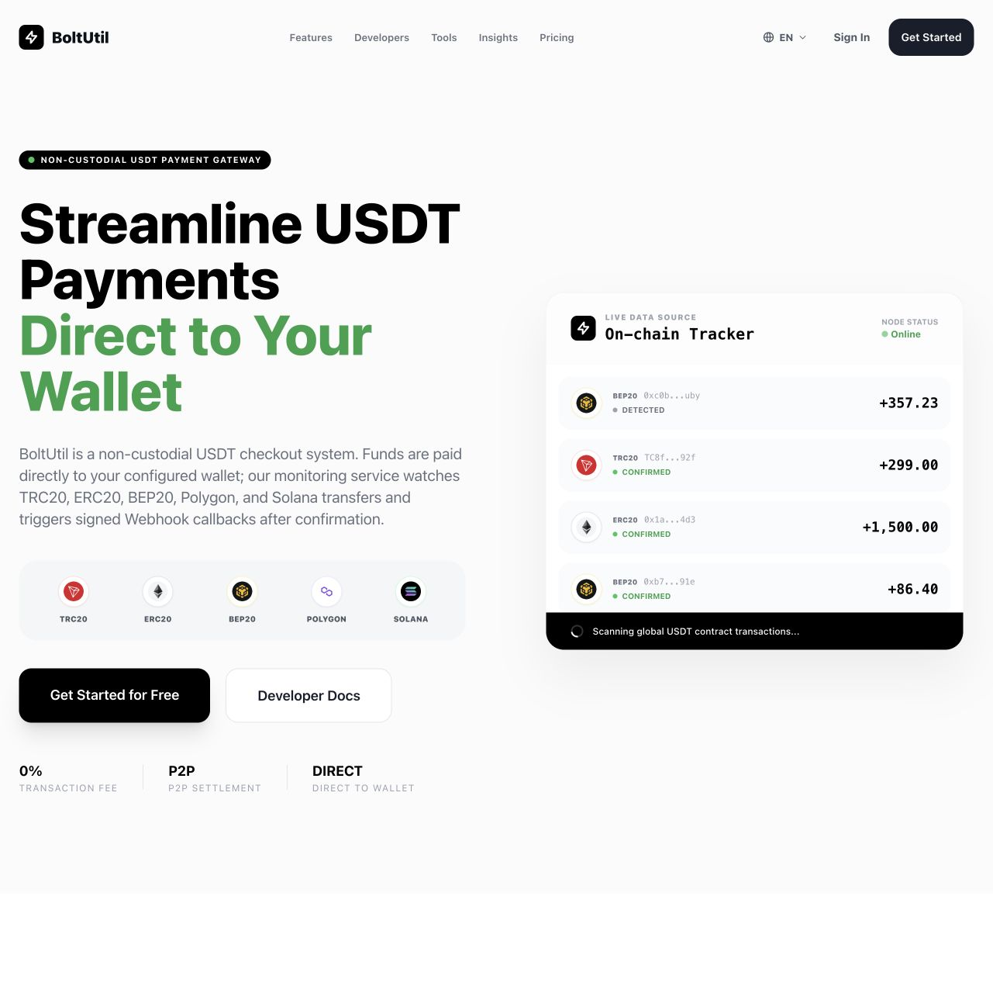
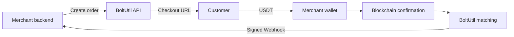
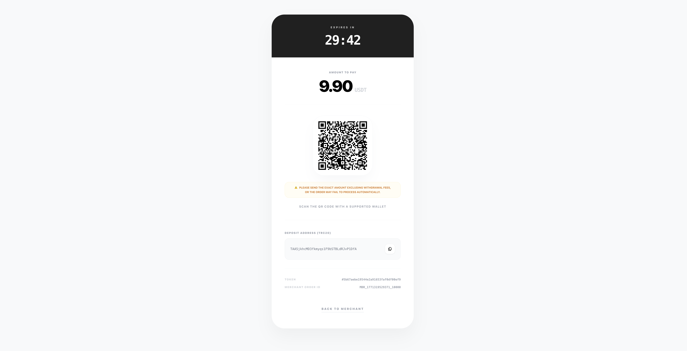

# BoltUtil

[English](README.md) | [简体中文](README.zh-CN.md)

## Accept USDT payments directly to your own wallet

**BoltUtil is a non-custodial payment API and hosted checkout for TRON, Ethereum, BNB Smart Chain, Polygon, and Solana.** Create an order from your backend, let the customer pay the exact amount to your configured wallet, and receive a signed Webhook after confirmation.

[](https://boltutil.com/?utm_source=github&utm_medium=referral&utm_campaign=boltutil_repo)
[](https://boltutil.com/developer-docs?utm_source=github&utm_medium=referral&utm_campaign=boltutil_repo)
[](https://boltutil.com/features?utm_source=github&utm_medium=referral&utm_campaign=boltutil_repo)
[](https://boltutil.com/guides/non-custodial-usdt-payments?utm_source=github&utm_medium=referral&utm_campaign=boltutil_repo)
[](https://github.com/changye0413/BoltUtil/actions/workflows/examples.yml)

[Get started](https://boltutil.com/register?utm_source=github&utm_medium=referral&utm_campaign=boltutil_repo) · [Read the API docs](https://boltutil.com/developer-docs?utm_source=github&utm_medium=referral&utm_campaign=boltutil_repo) · [Run the Node.js example](examples/node/boltutil-demo.js) · [Ask an integration question](https://github.com/changye0413/BoltUtil/discussions)



## Why BoltUtil

- **Funds settle directly to the merchant wallet.** BoltUtil does not request private keys, seed phrases, or withdrawal permissions.
- **One integration covers five USDT networks.** The order, checkout, status, and Webhook workflow stays consistent across supported chains.
- **Payment operations are built in.** Exact-amount matching, confirmation tracking, signed Webhooks, delivery logs, retries, and manual reconciliation are available through one merchant workflow.

BoltUtil is not an exchange, wallet custodian, or pooled settlement account. It is the operational layer that connects an on-chain transfer to a merchant order.

## Quick start

1. [Create a merchant account](https://boltutil.com/register?utm_source=github&utm_medium=referral&utm_campaign=boltutil_repo).
2. Add a settlement wallet and create an API key.
3. Configure an HTTPS Webhook endpoint and copy its signing secret.
4. Create a payment order from your backend.
5. Verify the signed Webhook before fulfilling the order.

```http
POST /api/v1/order/create
Content-Type: application/json
X-Bolt-Key: bt_live_xxx
X-Bolt-Timestamp: 1783800000000
X-Bolt-Signature: hmac_sha256(timestamp + "." + raw_request_body)
```

```json
{
  "externalOrderId": "ORDER-10001",
  "amount": "49.90",
  "currency": "USDT",
  "network": "TRC20",
  "notifyUrl": "https://merchant.example.com/webhooks/boltutil",
  "returnUrl": "https://merchant.example.com/orders/10001"
}
```

The response contains the exact payable amount, receiving address, order token, expiration time, and hosted checkout URL. Always display the returned payable amount without rounding it.

[Create-order reference](https://boltutil.com/docs/create-order?utm_source=github&utm_medium=referral&utm_campaign=boltutil_repo) · [Node.js integration guide](https://boltutil.com/guides/accept-usdt-payments-nodejs?utm_source=github&utm_medium=referral&utm_campaign=boltutil_repo) · [Webhook verification](https://boltutil.com/docs/webhook-signature?utm_source=github&utm_medium=referral&utm_campaign=boltutil_repo)

Import [`openapi.yaml`](openapi.yaml) into an OpenAPI-compatible client, or use the ready-to-import [Postman collection](postman/BoltUtil.postman_collection.json).

## Supported USDT networks

| API value | Network | Token standard |
| --- | --- | --- |
| `TRC20` | TRON | TRC20 USDT |
| `ERC20` | Ethereum | ERC20 USDT |
| `BEP20` | BNB Smart Chain | BEP20 USDT |
| `POLYGON` | Polygon PoS | ERC20-compatible USDT |
| `SOLANA` | Solana | SPL-USDT |

Network availability, token-contract requirements, and confirmation policies are documented on the [features page](https://boltutil.com/features?utm_source=github&utm_medium=referral&utm_campaign=boltutil_repo).

## Payment flow


```mermaid
flowchart LR
    A[Merchant backend] -->|Create order| B[BoltUtil API]
    B -->|Checkout URL| C[Customer]
    C -->|USDT| D[Merchant wallet]
    D --> E[Blockchain confirmation]
    E --> F[BoltUtil matching]
    F -->|Signed Webhook| A
```

A transfer is evaluated against the selected network, official token contract or mint, destination wallet, payable amount, order state, validity window, and confirmation policy. A transfer never completes an unrelated order merely because its amount is close.

## Public integration examples

This repository is the **public documentation and merchant-integration hub** for BoltUtil. The production platform source code and private infrastructure are proprietary and are not included.

| Language | Create order | Verify Webhook |
| --- | --- | --- |
| Node.js | [`examples/node/boltutil-demo.js`](examples/node/boltutil-demo.js) | Included |
| Python | [`examples/python/boltutil_demo.py`](examples/python/boltutil_demo.py) | Included |
| PHP | [`examples/php/boltutil_demo.php`](examples/php/boltutil_demo.php) | Included |
| Go | [`examples/go/boltutil_demo.go`](examples/go/boltutil_demo.go) | Included |
| Java | [`examples/java/BoltUtilDemo.java`](examples/java/BoltUtilDemo.java) | Included |
| C# | [`examples/csharp/BoltUtilDemo.cs`](examples/csharp/BoltUtilDemo.cs) | Included |

See [the examples guide](examples/README.md) for environment variables and run commands. Never commit real API keys or signing secrets.

## Hosted checkout



The hosted checkout displays the selected network, exact payable amount, destination address, QR code, expiration countdown, and current payment state.

## Webhook safety checklist

- Verify `X-Bolt-Webhook-Signature` against the exact raw request body.
- Validate `X-Bolt-Webhook-Timestamp` and reject stale callbacks.
- Compare the merchant order ID, network, amount, and status with local records.
- Make fulfillment idempotent so a retry cannot deliver twice.
- Query the order-status API when reconciliation is required.
- Keep API credentials and Webhook secrets on the server.

Read the [Webhook signature guide](https://boltutil.com/docs/webhook-signature?utm_source=github&utm_medium=referral&utm_campaign=boltutil_repo) and [retry troubleshooting guide](https://boltutil.com/guides/webhook-retry-troubleshooting?utm_source=github&utm_medium=referral&utm_campaign=boltutil_repo).

## Developer resources

| Goal | Resource |
| --- | --- |
| Understand the product | [USDT payment gateway overview](https://boltutil.com/usdt-payment-gateway?utm_source=github&utm_medium=referral&utm_campaign=boltutil_repo) |
| Integrate an application | [Developer documentation](https://boltutil.com/developer-docs?utm_source=github&utm_medium=referral&utm_campaign=boltutil_repo) |
| Create an order | [Create-order API](https://boltutil.com/docs/create-order?utm_source=github&utm_medium=referral&utm_campaign=boltutil_repo) |
| Query payment status | [Order-status API](https://boltutil.com/docs/order-status?utm_source=github&utm_medium=referral&utm_campaign=boltutil_repo) |
| Verify a payment | [Payment verification guide](https://boltutil.com/guides/verify-usdt-payment?utm_source=github&utm_medium=referral&utm_campaign=boltutil_repo) |
| Compare network trade-offs | [TRC20 vs ERC20 vs BEP20](https://boltutil.com/compare/usdt-trc20-vs-erc20-vs-bep20?utm_source=github&utm_medium=referral&utm_campaign=boltutil_repo) |
| Review plans and limits | [Pricing](https://boltutil.com/pricing?utm_source=github&utm_medium=referral&utm_campaign=boltutil_repo) |

## Support and community

- Use [GitHub Discussions](https://github.com/changye0413/BoltUtil/discussions) for integration questions and product feedback.
- Use [GitHub Issues](https://github.com/changye0413/BoltUtil/issues/new/choose) for reproducible documentation or example problems.
- Read [SUPPORT.md](SUPPORT.md) before sharing diagnostic information.
- Report security concerns privately according to [SECURITY.md](SECURITY.md).

## License and product scope

The documentation and integration examples in this repository are available under the [MIT License](LICENSE). That license applies only to files published in this repository; it does not grant access to or rights in the proprietary BoltUtil platform, backend, frontend, infrastructure, trademarks, or hosted service.

See [NOTICE.md](NOTICE.md) for the scope clarification and [CHANGELOG.md](CHANGELOG.md) for public integration updates.
