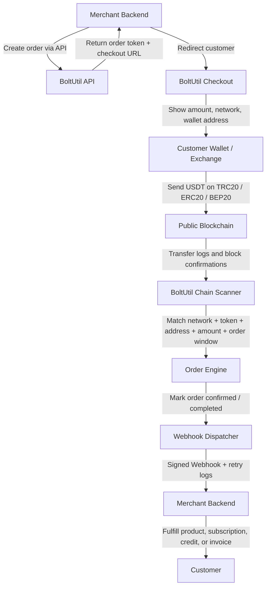
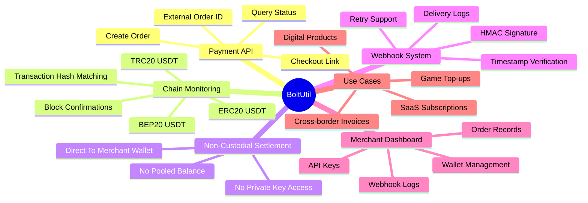
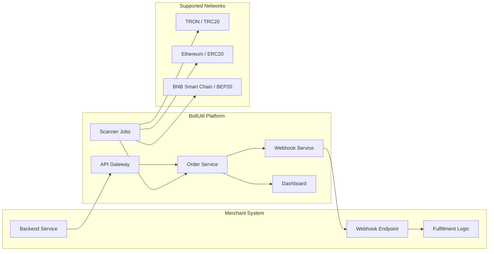

# BoltUtil

**Non-custodial USDT payment infrastructure for developers and internet merchants.**

BoltUtil helps merchants accept USDT payments without holding customer funds. Merchants create payment orders through an API, customers transfer USDT directly to the merchant wallet, and BoltUtil monitors TRC20, ERC20, and BEP20 transfers to send signed Webhook notifications after on-chain confirmation.

> Keywords: USDT payment gateway, crypto payment API, TRC20 payment gateway, ERC20 USDT payment, BEP20 USDT payment, non-custodial payment, blockchain payment webhook, stablecoin checkout, HMAC webhook, merchant crypto payment.

[Website](https://boltutil.com) · [Developer Docs](https://boltutil.com/developer-docs) · [USDT Gateway](https://boltutil.com/usdt-payment-gateway) · [Webhook Guide](https://boltutil.com/usdt-webhook)

---

## What Is BoltUtil?

BoltUtil is a payment monitoring gateway designed for teams that want to accept USDT while keeping settlement direct and transparent.

Traditional crypto payment processors often introduce a custodial account or settlement layer. BoltUtil uses a non-custodial model: funds move directly on-chain from the payer to the merchant wallet, while BoltUtil provides the operational layer around that transfer:

- order creation
- checkout link generation
- TRC20 / ERC20 / BEP20 transfer monitoring
- amount, address, token, network, and expiration-window matching
- block confirmation tracking
- signed Webhook delivery
- retry logs and operational visibility

BoltUtil is not an exchange, wallet custodian, or pooled settlement account. It is infrastructure for detecting and confirming payments that already happen on public blockchains.

---

## Why Developers Use BoltUtil

### Direct-to-wallet settlement

Customer funds are sent directly to the wallet configured by the merchant. BoltUtil does not take custody of private keys or hold merchant balances.

### One API for three major USDT networks

Integrate once and support USDT payments across:

- **TRC20** on TRON
- **ERC20** on Ethereum
- **BEP20** on BNB Smart Chain

### Signed Webhook notifications

Every payment notification can be verified with HMAC signature headers, helping merchants protect fulfillment systems from forged callbacks.

### Built for real merchant workflows

BoltUtil supports checkout links, external order IDs, payment expiration, confirmation tracking, retryable Webhooks, dashboard logs, and order status queries.

### Non-custodial by design

The platform focuses on monitoring and notification. Settlement remains on-chain and direct between payer and merchant.

---

## Payment Flow


```mermaid
flowchart TD
    A["Merchant Backend"] -->|"Create order via API"| B["BoltUtil API"]
    B -->|"Return order token + checkout URL"| A
    A -->|"Redirect customer"| C["BoltUtil Checkout"]
    C -->|"Show amount, network, wallet address"| D["Customer Wallet / Exchange"]
    D -->|"Send USDT on TRC20 / ERC20 / BEP20"| E["Public Blockchain"]
    E -->|"Transfer logs and block confirmations"| F["BoltUtil Chain Scanner"]
    F -->|"Match network + token + address + amount + order window"| G["Order Engine"]
    G -->|"Mark order confirmed / completed"| H["Webhook Dispatcher"]
    H -->|"Signed Webhook + retry logs"| I["Merchant Backend"]
    I -->|"Fulfill product, subscription, credit, or invoice"| J["Customer"]
```

---

## Product Mind Map


```mermaid
mindmap
  root((BoltUtil))
    Payment API
      Create Order
      Query Status
      Checkout Link
      External Order ID
    Chain Monitoring
      TRC20 USDT
      ERC20 USDT
      BEP20 USDT
      Block Confirmations
      Transaction Hash Matching
    Non-Custodial Settlement
      Direct To Merchant Wallet
      No Private Key Access
      No Pooled Balance
    Webhook System
      HMAC Signature
      Timestamp Verification
      Delivery Logs
      Retry Support
    Merchant Dashboard
      API Keys
      Wallet Management
      Order Records
      Webhook Logs
    Use Cases
      SaaS Subscriptions
      Digital Products
      Game Top-ups
      Cross-border Invoices
```

---

## Core Capabilities

| Area | Capability |
| --- | --- |
| Payment order | Create USDT payment orders with merchant-defined external order IDs |
| Checkout | Hosted checkout page for customer payment guidance |
| Networks | TRC20, ERC20, and BEP20 USDT monitoring |
| Matching | Match by network, token contract, destination address, amount, status, and expiration |
| Confirmation | Track transaction hash, block number, and confirmation count |
| Webhook | Signed payment callbacks with retry and delivery logs |
| Dashboard | Manage wallets, API keys, orders, Webhook settings, and logs |
| Security | HMAC signatures, timestamp verification, API key authentication, non-custodial architecture |

---

## Typical Use Cases

- **SaaS subscriptions**: activate plans after confirmed USDT payment.
- **Digital products**: unlock downloads, API credits, or licenses after payment.
- **Game top-ups**: credit user balances after on-chain confirmation.
- **Cross-border invoices**: accept stablecoin settlement without manual block explorer checks.
- **Developer tools**: add crypto checkout and payment Webhooks to existing systems.

---

## Architecture Overview


```mermaid
flowchart LR
    subgraph Merchant["Merchant System"]
        M1["Backend Service"]
        M2["Fulfillment Logic"]
        M3["Webhook Endpoint"]
    end

    subgraph BoltUtil["BoltUtil Platform"]
        B1["API Gateway"]
        B2["Order Service"]
        B3["Scanner Jobs"]
        B4["Webhook Service"]
        B5["Dashboard"]
    end

    subgraph Chains["Supported Networks"]
        C1["TRON / TRC20"]
        C2["Ethereum / ERC20"]
        C3["BNB Smart Chain / BEP20"]
    end

    M1 --> B1
    B1 --> B2
    B2 --> B5
    B3 --> C1
    B3 --> C2
    B3 --> C3
    B3 --> B2
    B2 --> B4
    B4 --> M3
    M3 --> M2
```

---

## API Example

Create an order:

```http
POST /api/v1/order/create
Content-Type: application/json
X-Bolt-Key: bt_live_xxx
X-Bolt-Timestamp: 1760000000000
X-Bolt-Signature: hmac_sha256_signature
```

```json
{
  "externalOrderId": "ORDER-10001",
  "amount": "49.90",
  "currency": "USDT",
  "network": "TRC20",
  "notifyUrl": "https://merchant.example.com/webhooks/boltutil",
  "returnUrl": "https://merchant.example.com/orders/10001"
}
```

Webhook payload:

```json
{
  "externalOrderId": "ORDER-10001",
  "status": "CONFIRMED",
  "currency": "USDT",
  "network": "TRC20",
  "amount": "49.90",
  "txHash": "0x...",
  "confirmations": 20,
  "completedAt": "2026-05-18T12:00:00"
}
```

---

## Security Model

BoltUtil is designed around a clear separation of responsibilities:

- **Merchant owns the wallet.** BoltUtil never asks for private keys.
- **Blockchain performs settlement.** Funds move through the supported public networks.
- **BoltUtil monitors and verifies.** The platform detects matching transfers and tracks confirmations.
- **Merchant verifies Webhooks.** HMAC signatures and timestamps help protect callback endpoints.

Recommended production practices:

- verify every Webhook signature
- use HTTPS callback URLs
- keep API keys and Webhook secrets server-side
- reconcile using the order status API
- avoid fulfilling orders before the expected confirmation threshold

---

## Suggested GitHub Topics

To improve GitHub search discovery, add these repository topics:

```text
usdt-payment-gateway
crypto-payment-api
trc20
erc20
bep20
stablecoin-payments
non-custodial
webhook
hmac
spring-boot
nuxt
payment-infrastructure
blockchain-payments
merchant-tools
```

Suggested repository description:

```text
Non-custodial USDT payment gateway for TRC20, ERC20, and BEP20. Create payment orders, monitor on-chain transfers, and receive signed Webhook notifications.
```

---

## 简体中文介绍

BoltUtil 是一个面向开发者和互联网商户的 **非托管 USDT 支付网关**。

商户通过 API 创建订单，用户将 USDT 直接转入商户配置的钱包地址，BoltUtil 负责监听 TRC20、ERC20、BEP20 链上转账，并在达到确认条件后向商户服务器发送带签名的 Webhook 通知。

### 核心价值

- **资金直达钱包**：平台不托管资金，不接触私钥。
- **三链 USDT 支持**：TRC20、ERC20、BEP20 一套 API 接入。
- **自动订单匹配**：按网络、币种、收款地址、金额、订单状态和有效期匹配。
- **确认后通知**：记录交易哈希、区块高度和确认数。
- **安全 Webhook**：HMAC 签名、时间戳校验、投递日志和失败重试。
- **商户后台**：管理钱包、API Key、订单、Webhook 配置和通知日志。

适用于 SaaS 订阅、数字产品、游戏充值、跨境账单、开发者工具等场景。

---

## Tech Stack

- Backend: Java, Spring Boot, Spring Security, Spring Data JPA
- Frontend: Nuxt, Vue, TypeScript
- Database: MySQL
- Cache / infrastructure: Redis-ready architecture
- Blockchain monitoring: TRON, Ethereum, BNB Smart Chain

---

## License

This project is maintained by the BoltUtil team. Review the repository license before production or commercial redistribution.

