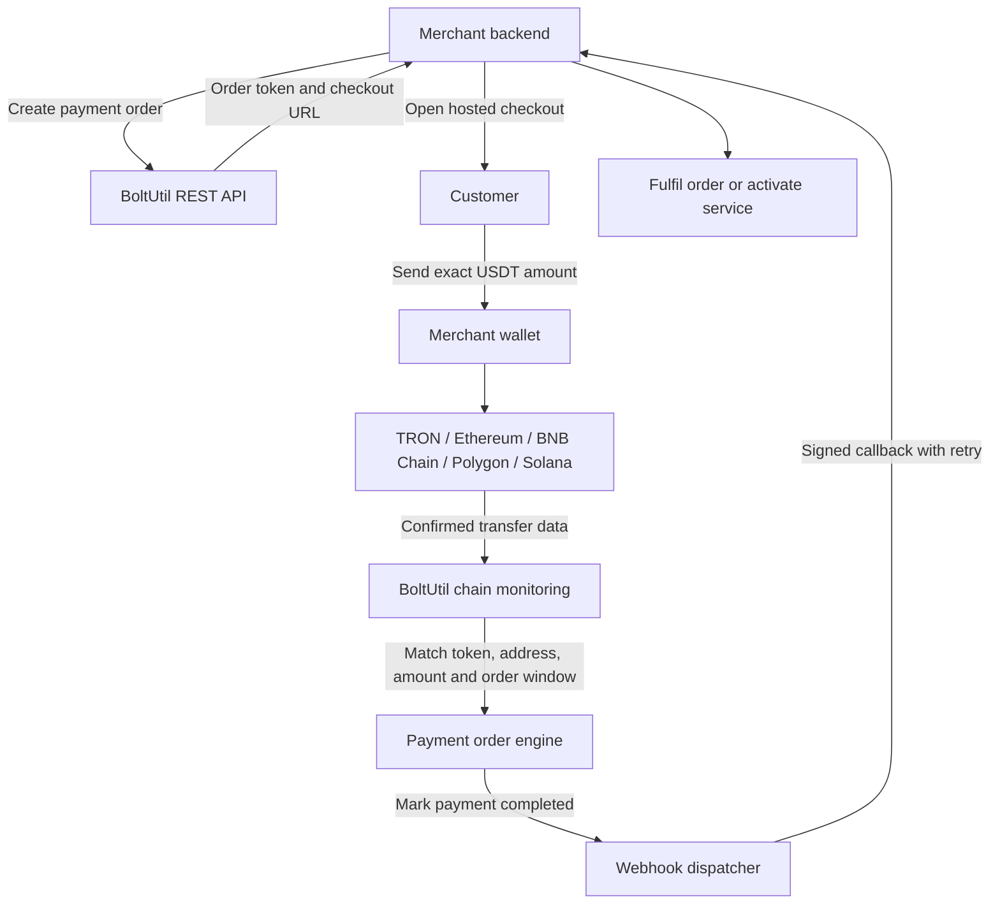
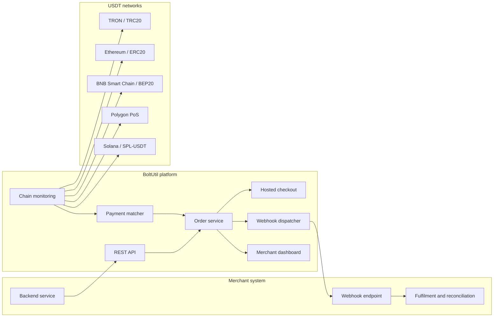

# BoltUtil

**Non-custodial USDT payment gateway and crypto payment API for developers, SaaS products, digital businesses, and internet merchants.**

[](https://boltutil.com)
[](https://boltutil.com/features)
[](https://boltutil.com/guides/non-custodial-usdt-payments)
[](https://boltutil.com/developer-docs)
[](https://boltutil.com/pricing)

BoltUtil turns on-chain USDT transfers into a predictable payment workflow. Merchants create payment orders through a REST API, customers send USDT directly to the merchant's configured wallet, and BoltUtil monitors the selected blockchain before sending a signed Webhook notification.

It supports **TRC20 (TRON), ERC20 (Ethereum), BEP20 (BNB Smart Chain), Polygon PoS, and Solana SPL-USDT** through one integration.

[Website](https://boltutil.com) | [Developer Documentation](https://boltutil.com/developer-docs) | [Node.js Guide](https://boltutil.com/guides/accept-usdt-payments-nodejs) | [USDT Gateway](https://boltutil.com/usdt-payment-gateway) | [Webhook Guide](https://boltutil.com/usdt-webhook) | [Pricing](https://boltutil.com/pricing)

---

## What Is BoltUtil?

BoltUtil is a **non-custodial stablecoin payment infrastructure service**. It provides the order, checkout, blockchain monitoring, payment matching, confirmation, Webhook, retry, and reconciliation layers needed to accept USDT on a website or inside an application.

Unlike a custodial crypto processor, BoltUtil does not receive customer funds into a pooled platform account. The payer transfers USDT directly to a wallet controlled by the merchant. BoltUtil observes public blockchain data and connects the transfer to the correct business order.

BoltUtil is useful when a team needs to:

- accept USDT payments on a website or SaaS product;
- expose a crypto payment API to an existing backend;
- create hosted USDT checkout links;
- monitor TRC20, ERC20, BEP20, Polygon, and Solana transfers;
- match blockchain transfers to merchant order IDs;
- receive signed payment Webhooks after confirmation;
- retry failed Webhook deliveries and inspect delivery logs;
- reconcile transaction hashes with completed orders;
- keep settlement direct to the merchant wallet.

BoltUtil is not an exchange, wallet custodian, or pooled settlement account. It is the operational layer around direct on-chain settlement.

---

## Supported USDT Networks

One API and one Webhook format support five production networks:

| API network | Blockchain | Token standard | Typical reason to use it |
| --- | --- | --- | --- |
| `TRC20` | TRON | TRC20 USDT | Low transfer fees and broad exchange support |
| `ERC20` | Ethereum | ERC20 USDT | Mature Ethereum ecosystem and mainnet settlement |
| `BEP20` | BNB Smart Chain | BEP20 USDT | Fast confirmations and low on-chain cost |
| `POLYGON` | Polygon PoS | ERC20-compatible USDT | EVM compatibility with inexpensive transactions |
| `SOLANA` | Solana | SPL-USDT | High throughput and low transaction fees |

The same order model, exact-amount matching rules, checkout experience, status API, and signed Webhook structure are used across all supported networks.

---

## Why Developers Use BoltUtil

### Direct-to-wallet settlement

Customers pay the receiving address configured by the merchant. BoltUtil does not request private keys, seed phrases, or withdrawal permissions.

### One crypto payment API for five networks

The business integration stays consistent when the customer chooses TRON, Ethereum, BNB Smart Chain, Polygon, or Solana. Network-specific monitoring remains behind one payment-order API.

### Exact payment matching

A transfer is matched using the network, token contract, destination address, payable amount, order status, and payment window. When several pending orders share a wallet, BoltUtil can assign a tiny amount adjustment to distinguish simultaneous payments.

### Signed Webhook notifications

Payment callbacks include signature and timestamp headers. Merchants verify the HMAC signature before activating a subscription, delivering a digital product, crediting a balance, or marking an invoice paid.

### Hosted checkout

The checkout page displays the selected network, exact payable amount, receiving address, QR code, expiration countdown, and current payment state.

### Operational visibility

The merchant dashboard includes payment records, transaction hashes, API keys, receiving wallets, Webhook configuration, delivery logs, retry results, and membership controls.

---

## Payment Flow


```mermaid
flowchart TD
    A["Merchant backend"] -->|"Create payment order"| B["BoltUtil REST API"]
    B -->|"Order token and checkout URL"| A
    A -->|"Open hosted checkout"| C["Customer"]
    C -->|"Send exact USDT amount"| D["Merchant wallet"]
    D --> E["TRON / Ethereum / BNB Chain / Polygon / Solana"]
    E -->|"Confirmed transfer data"| F["BoltUtil chain monitoring"]
    F -->|"Match token, address, amount and order window"| G["Payment order engine"]
    G -->|"Mark payment completed"| H["Webhook dispatcher"]
    H -->|"Signed callback with retry"| A
    A --> I["Fulfil order or activate service"]
```

### Matching rules

A transfer must match the expected:

1. blockchain network;
2. official USDT token contract or mint;
3. merchant receiving wallet;
4. exact payable amount;
5. pending order state;
6. payment validity window;
7. required confirmation or finality policy.

The transaction hash, block or slot information, amount, network, wallet, and completion time are stored as reconciliation evidence.

---

## Quick Start

1. [Create a BoltUtil merchant account](https://boltutil.com/register).
2. Add a receiving wallet for one or more supported networks.
3. Create an API key in the merchant dashboard.
4. Configure an HTTPS Webhook callback URL.
5. Create a payment order from your backend.
6. Redirect the customer to the returned checkout URL.
7. Verify the signed Webhook before fulfilling the order.
8. Query the order status when reconciliation or recovery is needed.

Keep API keys and Webhook secrets on the server. Never expose them in browser code, mobile bundles, or public repositories.

---

## Create a USDT Payment Order

```http
POST /api/v1/order/create
Content-Type: application/json
X-Bolt-Key: bt_live_xxx
X-Bolt-Timestamp: 1783800000000
X-Bolt-Signature: hmac_sha256_signature
```

```json
{
  "externalOrderId": "ORDER-10001",
  "amount": "49.90",
  "currency": "USDT",
  "network": "SOLANA",
  "notifyUrl": "https://merchant.example.com/webhooks/boltutil",
  "returnUrl": "https://merchant.example.com/orders/10001"
}
```

The API returns the order token, selected network, receiving wallet, exact payable amount, expiration information, and hosted checkout URL. Use the amount returned by BoltUtil; do not round or replace it with the original product price.

See the complete [create-order API documentation](https://boltutil.com/docs/create-order) and [Node.js integration guide](https://boltutil.com/guides/accept-usdt-payments-nodejs).

---

## Signed Payment Webhook

After a matching transfer reaches the configured confirmation policy, BoltUtil sends a payment callback to the merchant endpoint.

```json
{
  "externalOrderId": "ORDER-10001",
  "status": "COMPLETED",
  "currency": "USDT",
  "network": "SOLANA",
  "amount": "49.90",
  "txHash": "5w...example...signature",
  "confirmations": 1,
  "completedAt": "2026-07-12T10:30:00Z"
}
```

Production integrations should:

- verify the Webhook HMAC signature;
- validate the callback timestamp and reject stale requests;
- compare `externalOrderId`, network, amount, and status with local data;
- make fulfilment idempotent;
- return a successful HTTP response only after the event is accepted;
- use the order status endpoint when a callback must be reconciled;
- keep an internal audit trail for fulfilment actions.

Read the [Webhook signature documentation](https://boltutil.com/docs/webhook-signature) and [Webhook retry guide](https://boltutil.com/guides/webhook-retry-troubleshooting).

---

## Core Capabilities

| Area | Capability |
| --- | --- |
| Payment API | Create USDT orders with merchant-defined external order IDs |
| Multi-chain | TRC20, ERC20, BEP20, Polygon, and Solana USDT |
| Checkout | Hosted payment page with QR code, amount, address, network, and countdown |
| Matching | Network, token, wallet, amount, status, and order-window validation |
| Confirmation | Block confirmation or chain-finality tracking |
| Webhooks | HMAC-signed callbacks with timestamp verification |
| Reliability | Delivery logs, retry handling, order-status recovery, and reconciliation |
| Dashboard | Wallets, API keys, orders, Webhook settings, and notification logs |
| Security | Non-custodial architecture and server-side API authentication |
| Localization | Public product and developer content available in multiple languages |

---

## Use Cases

### SaaS subscriptions

Create a USDT checkout for a monthly or annual plan and activate the account only after receiving a verified payment callback.

### Digital products

Deliver software licenses, downloads, templates, API credits, or premium content after a confirmed payment.

### AI tools and developer platforms

Sell usage credits or subscription access without building a blockchain scanner and Webhook retry system from scratch.

### Game top-ups

Connect an external game order ID to an on-chain transfer and credit the player balance through an idempotent callback handler.

### Cross-border invoices

Accept stablecoin settlement and automatically connect the transaction hash to an invoice or internal accounting record.

### Ecommerce and online services

Offer USDT checkout alongside existing payment methods while keeping funds in a merchant-controlled wallet.

---

## Architecture


```mermaid
flowchart LR
    subgraph Merchant["Merchant system"]
        M1["Backend service"]
        M2["Webhook endpoint"]
        M3["Fulfilment and reconciliation"]
    end

    subgraph BoltUtil["BoltUtil platform"]
        B1["REST API"]
        B2["Order service"]
        B3["Hosted checkout"]
        B4["Chain monitoring"]
        B5["Payment matcher"]
        B6["Webhook dispatcher"]
        B7["Merchant dashboard"]
    end

    subgraph Networks["USDT networks"]
        C1["TRON / TRC20"]
        C2["Ethereum / ERC20"]
        C3["BNB Smart Chain / BEP20"]
        C4["Polygon PoS"]
        C5["Solana / SPL-USDT"]
    end

    M1 --> B1
    B1 --> B2
    B2 --> B3
    B4 --> C1
    B4 --> C2
    B4 --> C3
    B4 --> C4
    B4 --> C5
    B4 --> B5
    B5 --> B2
    B2 --> B6
    B6 --> M2
    M2 --> M3
    B2 --> B7
```

---

## Security Model

BoltUtil uses a clear trust boundary:

- **The merchant owns the receiving wallet.** BoltUtil does not ask for private keys or seed phrases.
- **The blockchain performs settlement.** Funds move from the payer to the configured merchant address.
- **BoltUtil monitors public data.** It validates token contracts, destination addresses, amounts, confirmation state, and order windows.
- **The merchant verifies callbacks.** HMAC signatures and timestamps protect the fulfilment endpoint.

Recommended controls:

- keep API credentials and Webhook secrets server-side;
- use HTTPS for all callbacks and return URLs;
- rotate compromised API keys immediately;
- use constant-time signature comparison;
- implement idempotent order fulfilment;
- reconcile important orders using the status API;
- wait for the configured confirmation threshold;
- validate the network and official USDT token contract;
- monitor callback failures and retry outcomes.

---

## Developer Resources

| Goal | Resource |
| --- | --- |
| Understand the product | [USDT payment gateway overview](https://boltutil.com/usdt-payment-gateway) |
| Review all supported features | [BoltUtil features](https://boltutil.com/features) |
| Integrate with Node.js | [Accept USDT payments with Node.js](https://boltutil.com/guides/accept-usdt-payments-nodejs) |
| Create an order | [Create-order API](https://boltutil.com/docs/create-order) |
| Query payment status | [Order-status API](https://boltutil.com/docs/order-status) |
| Verify callbacks | [Webhook signature guide](https://boltutil.com/docs/webhook-signature) |
| Debug payment matching | [Verify a USDT payment](https://boltutil.com/guides/verify-usdt-payment) |
| Understand exact amounts | [Exact amount matching](https://boltutil.com/guides/usdt-exact-amount-matching) |
| Compare networks | [TRC20 vs ERC20 vs BEP20](https://boltutil.com/compare/usdt-trc20-vs-erc20-vs-bep20) |
| Explore crypto tools | [Crypto resources directory](https://boltutil.com/tools/crypto-resources) |
| Review pricing | [Pricing](https://boltutil.com/pricing) |

---

## Technology

The BoltUtil product uses:

- **Backend:** Java, Spring Boot, Spring Security, Spring Data JPA;
- **Frontend:** Nuxt, Vue, TypeScript, Tailwind CSS;
- **Database:** MySQL;
- **Infrastructure:** Redis-backed caching and distributed coordination;
- **Blockchain integrations:** TRON, Ethereum, BNB Smart Chain, Polygon, and Solana;
- **Observability:** chain synchronization logs, health inspection, notification logs, and reconciliation records.

This repository is the public project overview and integration entry point. Production credentials, private infrastructure configuration, and merchant secrets are not included.

---

## FAQ

### Is BoltUtil a custodial crypto payment processor?

No. USDT is sent directly to the wallet configured by the merchant. BoltUtil monitors the transfer and manages the order notification workflow.

### Which USDT networks are supported?

TRC20 on TRON, ERC20 on Ethereum, BEP20 on BNB Smart Chain, USDT on Polygon PoS, and SPL-USDT on Solana.

### Can I accept USDT payments on a website?

Yes. A backend creates an order through the API and redirects the customer to the hosted checkout page. The merchant receives a signed Webhook after payment confirmation.

### Does BoltUtil charge a transaction commission?

BoltUtil advertises a 0% platform transaction fee. Blockchain network fees still apply to the payer's on-chain transfer. Review the current [pricing page](https://boltutil.com/pricing) for plan limits and features.

### How does BoltUtil distinguish simultaneous payments?

It matches the network, official USDT token, receiving address, exact payable amount, order state, and validity window. A tiny amount adjustment can distinguish concurrent pending orders that share one receiving wallet.

### How should a merchant handle missed Webhooks?

Webhook delivery includes logging and retry handling. The merchant should also query the order status endpoint during reconciliation and make fulfilment idempotent.

### Does BoltUtil need access to my private key?

No. Monitoring public blockchain transfers does not require private-key, seed-phrase, or withdrawal access.

---

## 简体中文

BoltUtil 是一个面向开发者、SaaS 产品和互联网商户的 **非托管 USDT 支付网关**。

商户通过 REST API 创建支付订单，用户把 USDT 直接转入商户配置的收款钱包。BoltUtil 负责监听链上转账、匹配订单、追踪确认状态，并在支付完成后向商户服务器发送带 HMAC 签名的 Webhook 通知。

目前统一支持五条 USDT 网络：

- TRC20 / TRON；
- ERC20 / Ethereum；
- BEP20 / BNB Smart Chain；
- Polygon PoS；
- Solana SPL-USDT。

### 核心价值

- **资金直达商户钱包：** 平台不托管用户资金，也不接触私钥和助记词。
- **五链统一接入：** 使用同一套订单 API、Checkout 页面和 Webhook 数据结构。
- **自动匹配订单：** 校验网络、USDT 合约、收款地址、精确金额、订单状态和有效期。
- **确认后自动通知：** 记录交易哈希、区块或 Slot、确认状态和完成时间。
- **安全回调：** 支持 HMAC 签名、时间戳校验、投递日志和失败重试。
- **商户管理后台：** 管理收款钱包、API Key、订单、Webhook 配置和通知记录。

适用于 SaaS 订阅、数字产品、AI 工具、游戏充值、跨境账单、开发者平台和电商服务。

---

## Search Terms

BoltUtil is relevant to developers researching a **USDT payment gateway**, **crypto payment API**, **stablecoin payment API**, **non-custodial crypto checkout**, **TRC20 payment gateway**, **ERC20 USDT payment**, **BEP20 payment integration**, **Polygon USDT payments**, **Solana USDT payments**, **blockchain payment monitoring**, or **signed payment Webhooks**.

---

## Project Links

- Website: [https://boltutil.com](https://boltutil.com)
- Developer docs: [https://boltutil.com/developer-docs](https://boltutil.com/developer-docs)
- Features: [https://boltutil.com/features](https://boltutil.com/features)
- Pricing: [https://boltutil.com/pricing](https://boltutil.com/pricing)
- Integration tools: [https://boltutil.com/tools/crypto-resources](https://boltutil.com/tools/crypto-resources)

## License and Usage

This repository is maintained by the BoltUtil team. Review the repository license and applicable service terms before redistribution, production integration, or commercial use.
